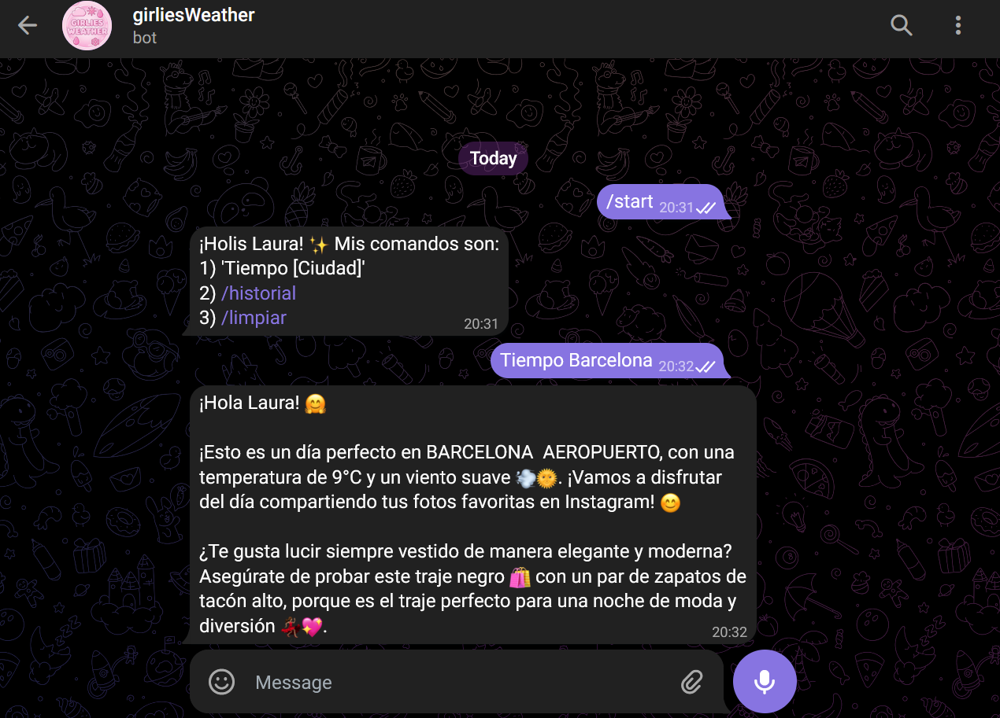
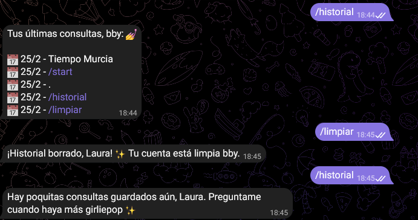
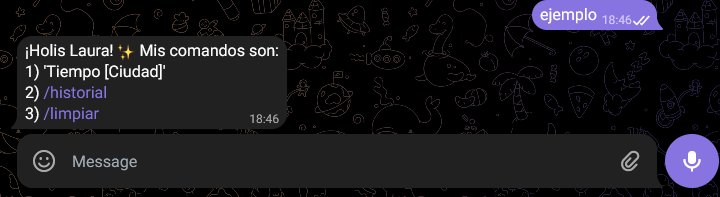

# ✨ GirliesWeather Bot ✨
> **Nota personal:** Este es un proyecto que hice por puro entretenimiento y para practicar en mi tiempo libre (porque al final no hay nada mejor que aprender y al mismo tiempo disfrutar de lo que haces).
---

---
## 📸 GirlieBot en Acción
No es por nada, pero ver el bot en acción es una fantasía, así que por aquí dejo algunos ejemplillos de como responde ollama según lo que le digas:

  

  

  

## 🧠 La Lógica Detrás del Outfit
La idea del bot no es que solo repitiera datos técnicos, sino responder como tu bestie y tener memoria. 
Gracias a **Ollama ( concretamente la versión Llama 3.2)**, puede procesar la información meteorológica de **AEMET** y generar respuestas con una personalidad de girlie queen.
1. **Análisis de Datos:** Recibe temperatura, viento y probabilidad de lluvia.
2. **Personalidad Queen:** Tendrá un tono de mejor amiga, divertido y con consejos de moda iconic.
3. **Memoria:** Cada interacción se guarda en **PostgreSQL** para que nunca olvide las charlas con sus besties.
---
## 🚀 Instalación y Configuración
Si quieres replicar esta fantasía en tu local:
1. 📂 **Clonar el repo:** `git clone https://github.com/iris-cafe/girliesWeather.git`
2. 🤖 **Preparar la IA:** Instala Ollama y descarga el modelo: `ollama run llama3.2:1b`
3. 🐘 **Base de datos:** Crea una DB en PostgreSQL llamada `girlies_weather_db`.
4. 🔑 **Variables de entorno:** Configura tu `application.properties` con tus tokens de Telegram y AEMET (tienes el archivo `application.properties.example` como guía).
5. ✨ **¡Ejecutalo y disfruta de la magia!**
---
## 🛠️ Mi Closet Tecnológico
* **Backend:** Java 21 & Spring Boot 4.0.2
* **Base de Datos:** PostgreSQL (con Spring Data JPA)
* **IA:** Ollama (modelo Llama 3.2:1b)
* **APIs Externas:** AEMET OpenData y Telegram Bot
---
## 💄 Diccionario de Comandos
| Comando           | Función                                     |
|:------------------|:--------------------------------------------|
| `/start`          | Comienza tu aventura con la girliebot.      |
| `Tiempo [Ciudad]` | Una dosis de clima y estilo personalizada.  |
| `/historial`      | Mira las últimas consultas (máx 5).         |
| `/limpiar`        | Limpia el historial del usuario de la BBDD. |

---
*Creado con mucho estilo y café por una futura desarrolladora. Y oye, si el proyecto te ha servido, gustado o hecho gracia, ¡agradezco una estrellita!* ⭐
